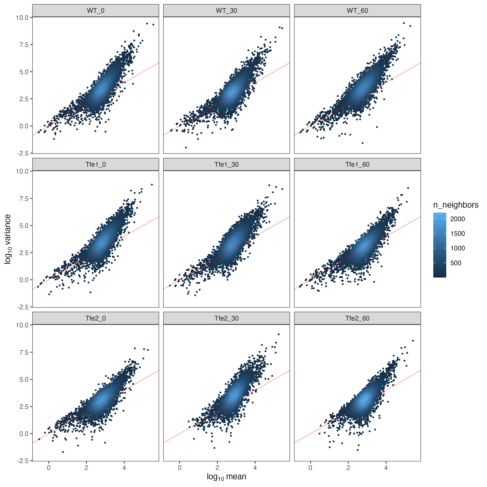
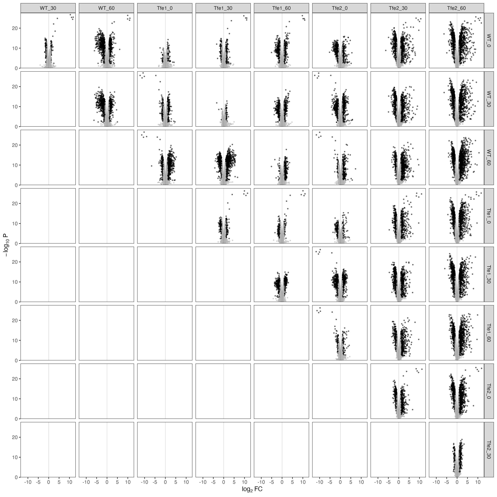

```{r options, echo=FALSE}
knitr::opts_chunk$set(
  warning = FALSE,
  message = FALSE,
  echo = FALSE,
  cache = TRUE,
  autodep = TRUE,
  ft.align = "left"
)
options(
  width = 100
)
N <- function(n) prettyNum(n, big.mark = ",")
```

```{r libraries, cache=FALSE}
library(targets)
library(tidyverse)
library(flextable)
library(DT)

tar_config_set(store = "../_targets")
```


Collaborators: Katharina Trunk, Sarah Coulthurst

# {.tabset}

## Proposal

We are looking at the toxicity of the bacterial Type6 secreted toxins Tfe1 and Tfe2 on fungal cells. Initially we were hoping to get dual RNA seq data of competition settings between C. albicans and S. marcescens but had to change plans due to experimental issues. So now we are looking at expression of those toxins in Saccharomyces cerevisiae, with the toxins being expressed via the galactose-inducible pGAL1 promoter, hence the rather late 30 and 60 min timepoints.
 
Timepoint 0 should be pretty similar between the WT, Tfe1 and Tfe2 samples as no toxin expression, but we do know from experience that there is some leakage to the promoter, so it could be that we see some background activity.
At time-points 30 and 60 we would hope to see initial and maybe adaptive responses to the toxins Tfe1 and Tfe2, but also adaptation to the additional carbon source galactose (time point 0 samples are grown in raffinose only, whilst later timepoints are grown in raffinose + galactose).
 

## Experiment


### Samples

```{r metadata}
tar_load(metadata) 

metadata %>% 
  select(strain, time, group, replicate, raw_sample, sample, scramble) %>% 
  flextable(col_keys = c("strain", "time", "group", "replicate", "raw_sample", "sample")) %>% 
  theme_box() %>% 
  merge_v(j = 1:3) %>% 
  bg(i = ~ scramble == TRUE, j = 5, "wheat")
```

Highlighted cells show mislabelled samples (see next section).

## Sequencing and mapping

### Sequencing

### Mapping

STAR version 2.7.10a was used to map reads to reference genome W303-A1 downloaded from yeastgenome.org. We also include Tfe1 and Tfe2 seqnuences in the reference to track expression of the toxins. The sequences are as follows:

```
>Tfe1
ATGCATTGGTTGAATTTCAAGCGCTACAAGAGTGACGTTGCCAAACAGGCCGTGCCGCCGCATTTGAATG
CGGCCGAATTTGCACGGCATTACGCCGATAAGCCGCAAACCGATACGGAAGAGTATCTTTCGCTCAGCGG
GGAGATGTGCTGGGATGCGGTGGTGCTTTGTGCCCACCGTTCTGGCGCGCTCAGCAAGGCGAAATACAAG
CAGTTGTGGCAGACGGTGTTCGATAAGCAATACAAACATTTCGTTAGCCCGGATGATACCGAGATCCGCA
CTATGGCCGATATGCTGCGCGCGCCGCAGGGATGTTTTATCGGCATATTCTCCCTGCGCGACGCGGCTGC
GCCCCGTTTGCTGCATGCCATGATCGGTACCGGTGCGGGATTTGCCGCAGGCAATAAAAATCTTTGCATC
GGCGTGGGGGGCGCGGTCGGCTGGGAAAATCTCAATCTGGCGCGCGATCTGCGCTGGCAGCCGGAAGGCG
GTTTTTTACGCCAGGGTGATAACGAAGTGCTGCGCATTTTTTATCGGCCTTTCCCCGCCTGA
>Tfe2
ATGCCATTAGAAGTCGATGGGATCATTAGAGGCGATCGGGGCAGTGAACCGAGCCGTTGGCAACATGCGT
CAACCAAACCGCTTATCACGCTGACCTGGCATCACACCATTCCTTGGAACTGTTTGCGTAATGTCTGGAA
TGGTCTGGTGGCGGGGCAGCATTGGAACGCGCTGGACGAGTTTATGAACCTGATCGGTGTGCCAAACCGT
GCCGAGGTGATCACACAGATCAAGAATAAAAACCTGCAGGATCGCGATGGATTACACACTCTGGTGACCT
GGCAAGGATGGAACATCGTCGAGGGGCCTGGTAATGAGTATCGTGCGCAGGGGGACGATCCCGGTGAAAA
CTTCGACGGTTGGTCGGGTAAGGGGATGAGCACTAATCAGCAAGCGACGCTGCAGCAGGTCAACGTGTTG
TATCAGGTGATGGCGCCGCTGGGAAGCCGTGCGCTGGACGCCGCCAGACAGGCGCCGAACATTTCTGCGG
AAGAAGCGAGCGTCTTGCAACGGACGATTAAACAGACCCGTCCAACGTTGCGAGGAAAGGAACCGATCCG
GTGGCAAGAAGACATGTGGCATCAGGTGCAGCCGGGTAAAGAGGCGAAACACTTCGCCCGTTGGGACACC
AAACCGGTGTGGCGCAAGCGCCTGCACAGCGATCTGGCTCAGGCTGGATAA
```
### Samples at 60h are scrambled

The plot below shows the number of reads mapped to Tfe reference. The columns show the strain, as included in the sample name, and rows show the reference it mapped to. Please not that the vertical scale is transformed to square root to clearly show low numbers.

```{r fig_tfe_raw, fig.width=7, fig.height=6}
tar_read(fig_tfe_raw)
```

It is immediately obvious that samples at 60h are scrambled - WT should have no counts at any reference, while 167 should only map to Tfe1 and 165 should only map to Tfe2. This can be seen if we cluster read counts per gene:

```{r fig_clust_raw, fig.width=6, fig.height=5}
tar_read(fig_clustering_raw)
```

By looking at both figure I came up with the following de-scrambling scheme:

```{r descram}
metadata %>% 
  filter(scramble) %>% 
  select(raw_sample, strain, time, replicate, sample) %>% 
  arrange(raw_sample) %>% 
  flextable()
```

After descrambling the Tfe and clustering figures look like this. In the Tfe plot the columns show the strain after descrambling, as included in corrected sample names.


```{r fig_tfe, fig.width=7, fig.height=6}
tar_read(fig_tfe)
```

```{r fig_clust_descram, fig.width=6, fig.height=5}
tar_read(fig_clustering)
```

This is probably correct.


### Mapping properties

STAR mapping results.

```{r star_properties}
tar_read(tab_star_log) %>% rmarkdown::paged_table()
```
<br>

STAR mapping log in graphical form.

```{r fig_star_log, fig.width=10, fig.height=8}
tar_read(fig_star_log) 
```

```{r fig_star_map, fig.width=10, fig.height=3}
tar_read(fig_star_log_map)  
```

### Input vs mapped and counted reads

The plot below shows the number of input reads from FASTQ files together with the number of uniquely mapped and counted reads in genes.

```{r input_counts, fig.width=10, fig.height=4}
tar_read(fig_map_count) 
```

There are very few reads counted in genes. In a typical RNA-seq experiment, we get 25-30 million reads in genes, here it is only about 5 million. This is going to have strong implications on the downstream analysis.

### FastQ screen

[FastQ screen](https://www.bioinformatics.babraham.ac.uk/projects/fastq_screen/) maps a sample of reads to several genomes to check for contamination. The plot below shows one hit one genome percentage. Note, the fill scale is logarithmic with grey indicating zero. 

```{r parse_fscreen, fig.width=8, fig.height=5}
tar_read(fig_fscreen)
```


### Read quality

```{r read_qual, fig.width=8, fig.height=3}
tar_read(fig_read_qual) 
```

Hierarchical clustering based on read quality. This has nothing to do with biology, but rather shows potential batch effects related to sequencing, e.g. different flow cells, different instruments.

```{r read_qual_clust, fig.width=6, fig.height=7}
tar_read(fig_read_qual_clust)
```


It seems data from 60 hours stand out. Any ideas?

### Strandedness

Depending on the protocol stranded data can be either way.
STAR provides the following in the quantification file:

-   column 2: counts for unstranded RNA-seq
-   column 3: counts for the 1st read strand aligned with RNA
-   column 4: counts for the 2nd read strand aligned with RNA

This figure shows the summary of total counts in each column of one example file.

```{r strandedness, fig.width=5, fig.height=3}
tar_read(fig_star_sense) 
```

Data come from the first strand, we are reading column 3.


## Properties

#### Read count distribution

A look at distribution of count reads per sample, a good way to spot any issues. 

```{r sample_dist, fig.width=12, fig.height=7}
tar_read(fig_sample_dist)
```

No issues here.


Another view of Gaussian kernel smoothed distributions in one plot.


```{r sample_dist_kernel, fig.width=5, fig.height=5}
tar_read(fig_kernels) 
```

#### Correlation matirx

Pearson's correlation coefficient for each pair of samples, calculated from [regularised logarithm](https://rdrr.io/bioc/DESeq2/man/rlog.html) (rlog) of raw count data.

```{r corrmat, fig.width=6, fig.height=5}
tar_read(fig_distance_mat)
```

#### PCA

Just as above, using rlog-transformed counts.


```{r fig_pca, fig.width=8, fig.height=7}
tar_read(fig_pca) 
```


#### Clustering of samples

Just as above, using rlog-transformed counts and correlation distance.

```{r clust_samp_1, fig.width=6, fig.height=5}
tar_read(fig_clustering)
```


#### Mean-variance relation

Mean and variance are calculated from counts normalised to library size.

```{r mean_var_1, out.width="100%"}
 
```


```{r, cache=FALSE, eval=FALSE}
knitr::knit_exit()
```


## Differential expression

Differential expression was done using *edgeR* version `r tar_read(edger_version)`. We define 'significantly differentially expressed' genes based on false discovery rate (FDR) and fold change (FC):

\[FDR < 0.01 \land |\log_2 FC| > 1\]

### Full pairwise comparison

```{r meta_groups}
groups <- metadata$group %>%
  as.character() %>% 
  unique()
```

For this analysis we divide data into `r length(groups)` groups, with each of them corresponding to one strain/time point. the groups are `r str_c(groups, collapse=  ", ")`. The plot below shows pairwise comparison of each-versus-each group in form of volcano plots. Black points in each plot mark significant genes.


```{r de_volcano_pairwise, out.width="100%"}
 
```

When we look at the number of up- and down-regulated genes,

```{r de_up_down_pairwise, fig.width=10, fig.height=4}
tar_read(fig_updown)
```


### A closer look

#### Strain contrast, as a function of time

```{r fig_volcano_time, fig.width=8, fig.height=8}
tar_read(fig_volcano_time)
```

#### Time contrast, as a function of strain

```{r fig_volcano_strain, fig.width=8, fig.height=8}
tar_read(fig_volcano_strain)
```


### Strain and time

We build a model `~ strain + time` to see the effect of strain and time separately. The baseline for the model is `strain = WT` and `time = 0`. 

```{r de_volcano_st, fig.width=10, fig.height=4}
tar_read(fig_volcano_f)
tar_read(fig_ma_f)
tar_read(fig_pdist_f)
```

```{r de_up_down_st, fig.width=4, fig.height=4}
tar_read(fig_updown_f)
```


## Gene set enrichment


Gene-set enrichment is a technique to find if functionally linked genes (that is, from the same GO-term) have non-random (up- of down-regulated) fold change. Column NES shows normalised enrichment score - the higher the score, the more upregulated the group of genes is, the lower the score, the more down-regulated. Only significant GO-terms or Reactome pathways are shown.

The enrichment score ES is calculated by walking down the ranked list of genes (ordered by logFC) and increasing a running-sum statistic when we encounter a gene in the GO-term and decreasing it when we encounter genes not in the GO-term. This creates a plot like this (`GO:0030476` - ascospore wall assembly, contrast Tfe2/WT at 60h):

```{r fig_fg_example_go_0030476, fig.width=5, fig.height=3}
tar_read(fig_fg_example_go_0030476)
```

The enrichment score ES is the extreme (positive or negative) achieved by the green curve - represented by the dashed red line. We see that genes linked to ascospore wall assemble are mostly up-regulated (concentrated at the upper part of the ranked list).

In contrast, a GO-term `GO:0032543`, (mitochondrial translation), has genes mostly down-regulated and creates a negative NES.

```{r fig_fg_example_go_0032543, fig.width=5, fig.height=3}
tar_read(fig_fg_example_go_0032543)
```

Results from GSE are available from the [gene set enrichment explorer](https://shiny.compbio.dundee.ac.uk/public/marek_yeast_tfe/gsea/).


## Tfe correlation

Our data includes Tfe1 and Tfe2 expression estimated from reads mapping to the respective sequences. We can use it to find genes whose expression correlates with Tfe1 and Tfe2. The correlation was calculated from normalised count, across all samples. Each gene was correlated with Tfe1 and Tfe2 expression profiles. The figure below show the correlation of each gene with Tfe1 plotted versus correlation with Tfe2.

```{r fig_tfe_cor, fig.width=4, fig.height=4}
tar_read(fig_tfe_cor)
```


### Example

Here is an example of how it works. This is gene SPS2, highly correlated with Tfe2:

```{r fig_tfe_sps2, fig.width=6, fig.height=6}
tar_read(fig_tfe_sps2)
```

and here is an example of a gene anti-correlated with Tfe2:

```{r fig_tfe_xpt1, fig.width=6, fig.height=6}
tar_read(fig_tfe_xpt1)
```


### Gene set enrichment

The correlation can be used to perform gene set enrichment, if there are functional terms or pathways for which the correlation is high, they will be identified by the analysis. Let's have a look again at the GO-term `GO:0030476`, ascospore wall assembly, using correlation with Tfe2.


```{r fig_tfe_fg_example_go_0030476, fig.width=5, fig.height=3}
tar_read(fig_tfe_fg_example_go_0030476)
```


Full results are available from the [gene set enrichment explorer](https://shiny.compbio.dundee.ac.uk/public/marek_yeast_tfe/gsea/).

## Sporulation

Sporulation comes up as one of the most important processes related to Tfe2 (gene set enrichment). Here are top 24 genes (according to logFC from `strainTfe2` coefficient in 'strain and time' differential expression) related to the GO term `GO:0030435`, sporulation resulting in formation of a cellular spore.

```{r fig_sporulation, fig.width=10, fig.height=12}
tar_read(fig_sporulation)
```


## Resources

### Downloads

 - [Normalised counts from all samples](http://www.compbio.dundee.ac.uk/user/mgierlinski/yeat_tfe/tab/normalised_counts.tsv)
 - [Differential expression pairwise](http://www.compbio.dundee.ac.uk/user/mgierlinski/pbrm/tab/de_pairwise.tsv)
 - [Differential expression by time and strain](http://www.compbio.dundee.ac.uk/user/mgierlinski/pbrm/tab/de_factors.tsv)
 - [Correlation between genes and Tfe](http://www.compbio.dundee.ac.uk/user/mgierlinski/pbrm/tab/tfe_correlation.tsv)
 
 
### Interactive data explorer

#### Introduction

These on-line tools allow to explore all the differential expression and gene set enrichment results. The contrast selection in the tool contains all combined 'contrasts', which include:

 - contrasts between selected conditions (e.g. `Tfe2_60-WT_60`)
 - coefficients in factor design, that is effect of time (`time30`, `time60`) and mutant (`strainTfe1`, `strainTfe2`) and (for GSE only) correlation of Tfe and gene expression (`corTfe1`, `corTfe2`).
 
#### Links

  - [Differential expression](https://shiny.compbio.dundee.ac.uk/public/marek_yeast_tfe/edger/)
  - [Gene set enrichment](https://shiny.compbio.dundee.ac.uk/public/marek_yeast_tfe/gsea/)

### Code

 - [R code on GitHub](https://github.com/bartongroup/MG_yeast_Tfe)
 
 
## Session info

```{r sesinfo}
tar_read(session_info)
```